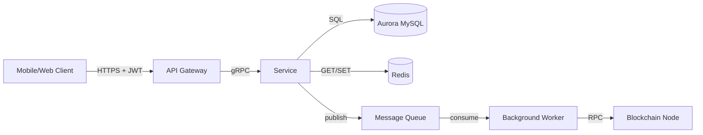

# Feature Security Design — Template

> **Cách dùng:** Copy file này sang `specs/{feature_name}/design.md` sau khi requirements.md được approve.

---

## Architecture Overview

### Data Flow Diagram



### Trust Boundaries

1. **Client ↔ API Gateway:** Untrusted ↔ Trusted DMZ
2. **API Gateway ↔ Service:** Trusted DMZ ↔ Trusted Internal
3. **Service ↔ Blockchain Node:** Trusted Internal ↔ External (blockchain)

Bất cứ data nào cross boundary phải:
- Validated tại trusted side
- Encrypted in transit (TLS)
- Signed nếu cần integrity (HMAC, JWT)

---

## Component Design

### API Endpoint

```
POST /api/v1/{resource}
Authorization: Bearer <jwt>
Idempotency-Key: <uuid>
Content-Type: application/json

{
  "field1": "...",
  "field2": "..."
}
```

**Middleware chain:**
1. Rate limit (per IP, per user)
2. Authentication (JWT verify)
3. Authorization (permission check)
4. Request validation (schema)
5. Idempotency check
6. → Handler

### Database Schema

```sql
CREATE TABLE feature_resource (
    id UUID PRIMARY KEY DEFAULT gen_random_uuid(),
    user_id UUID NOT NULL REFERENCES users(id),
    amount DECIMAL(36, 18) NOT NULL CHECK (amount > 0),
    currency VARCHAR(10) NOT NULL,
    status VARCHAR(20) NOT NULL CHECK (status IN ('pending', 'completed', 'failed')),
    idempotency_key VARCHAR(64) NOT NULL,
    created_at TIMESTAMPTZ NOT NULL DEFAULT NOW(),
    updated_at TIMESTAMPTZ NOT NULL DEFAULT NOW(),
    UNIQUE(user_id, idempotency_key)
);

CREATE INDEX idx_feature_user_status ON feature_resource(user_id, status);
CREATE INDEX idx_feature_created ON feature_resource(created_at DESC);
```

**Migration safety:**
- Backward-compatible: NEW code chạy được với OLD schema
- Forward-compatible: OLD code chạy được với NEW schema (trong window deploy)

### Async Processing

```
Service → Queue → Worker → External (blockchain/notification)
```

**Idempotency:** Worker phải idempotent — chạy 2 lần = chạy 1 lần.
**Retry:** Exponential backoff, max 5 retries.
**DLQ:** Failed jobs vào Dead Letter Queue cho manual review.

---

## Security Controls

### Input Validation

```python
class CreateRequest:
    amount: Decimal  # > 0, <= MAX
    currency: str    # Enum
    address: str     # Currency-specific regex
    idempotency_key: str  # UUID format
```

### Authentication

- JWT từ `Authorization: Bearer` header
- Verify: signature (RS256), expiry, issuer, audience
- Reject `alg: none`

### Authorization

```python
@require_permission("resource:create")
@require_kyc_level(2)
def create_resource(req, current_user):
    ...
```

### Rate Limiting

- Endpoint level: 30/min/user
- Action level: 5 withdrawals/hour/user

### Audit Logging

```python
audit_logger.info("feature_created", extra={
    "resource_id": resource.id,
    "user_id": current_user.id,
    "amount": str(resource.amount),  # Decimal serialize
    "currency": resource.currency,
    "request_id": req.id,
})
```

### Failure Modes

| Failure | Behavior |
|---|---|
| Database unavailable | Return 503, không retry tự động |
| Cache unavailable | Degraded mode, vẫn serve nhưng warn |
| Blockchain node unavailable | Withdrawal pending, retry sau |
| Queue unavailable | Return 503, request fail |

---

## Threat Mitigations

### Race Conditions

**Threat:** Concurrent withdrawal request → double-spend.

**Mitigation:** `SELECT ... FOR UPDATE` trong transaction:

```python
with db.transaction():
    balance = db.query(
        "SELECT balance FROM wallets WHERE user_id = ? FOR UPDATE",
        (user_id,)
    )
    if balance < amount:
        raise InsufficientFunds()
    # ... process
```

### Replay Attacks

**Threat:** Attacker resend valid signed request.

**Mitigation:** Idempotency key + timestamp + nonce.

### Insider Threat

**Threat:** Engineer with DB access manipulate user balance.

**Mitigation:**
- Audit log mọi UPDATE balance
- Daily reconciliation: sum(wallet.balance) == sum(deposit) - sum(withdrawal)
- Alert khi reconciliation mismatch

---

## Performance & Scaling

- API: stateless, horizontal scale
- DB: read replica cho query không critical
- Cache: Redis cluster
- Queue: managed service (SQS, RabbitMQ cluster)

---

## Observability

### Metrics

- Request rate, latency p50/p99
- Error rate by error code
- Queue depth, worker throughput
- DB connection pool utilization

### Alerts

- Error rate > 5% trong 5 phút
- Latency p99 > 2s trong 10 phút
- Queue backlog > 1000
- Reconciliation mismatch detected
